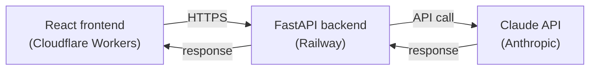

# DocLens

[](https://github.com/emdej111/doclens-ai-chat/actions/workflows/tests.yml)

AI-powered document analyzer — upload a PDF, get an instant summary, and ask questions about its contents in natural language.

> Built using AI-assisted development (Lovable for the frontend scaffold, Claude for iteration and the backend) — reflecting a modern development workflow where AI tools accelerate implementation while the developer owns architecture, integration, and product decisions. See [Known limitations](#known-limitations) for the trade-offs made along the way.

**🔗 Live demo:** https://emdej111-doclens-ai-chat.emdej111.workers.dev
**⚙️ Backend repo:** https://github.com/emdej111/doclens-backend


## What it does

DocLens lets you upload a PDF and immediately get:

- An **AI-generated summary** of the document
- A **chat interface** to ask follow-up questions about its content
- **Source-grounded answers** — every AI response links back to the exact passages it was drawn from, with a relevance score

It's built as a small end-to-end RAG (Retrieval-Augmented Generation) system: the backend chunks the document, retrieves the most relevant chunks for a given question, and asks Claude to answer using only that context.

## Tech stack

**Frontend** (this repo)
- React + TypeScript + Vite
- TanStack Router (file-based routing) + TanStack Query
- Tailwind CSS + shadcn/ui
- Deployed on Cloudflare Workers

**Backend** ([doclens-backend](https://github.com/emdej111/doclens-backend))
- FastAPI (Python)
- `pdfplumber` for text extraction
- Custom TF-IDF chunk retrieval (no vector DB — pure numpy)
- Anthropic API (Claude) for summarization and Q&A
- Deployed on Railway

## Architecture



The frontend is a static SPA that talks to the backend over a REST API. The backend has no database — uploaded documents and their extracted chunks live in memory for the lifetime of the process. This is a deliberate trade-off for a single-user demo (see [Known limitations](#known-limitations)).

## API

| Method | Endpoint | Description |
|---|---|---|
| `POST` | `/api/upload` | Upload a PDF, get back its summary and metadata |
| `POST` | `/api/ask` | Ask a question about a previously uploaded document |
| `GET` | `/api/documents` | List documents held in the current session |
| `DELETE` | `/api/documents/{id}` | Remove a document |
| `GET` | `/api/health` | Health check |

Full request/response shapes are in [`src/lib/api.ts`](./src/lib/api.ts).

## Running locally

You'll need Node.js and a running instance of the [backend](https://github.com/emdej111/doclens-backend) (or just use the deployed one — the frontend already points at it).

```sh
git clone https://github.com/emdej111/doclens-ai-chat.git
cd doclens-ai-chat
npm install
npm run dev
```

If the backend is unreachable, the app falls back to a **demo mode** with mock data, so the UI is still fully explorable without a live backend.

## Known limitations

This is a portfolio/demo project, not a production app:

- **No persistence** — documents are stored in memory on the backend and are lost on restart or redeploy.
- **No authentication** — single-user by design, so there's no login or per-user data isolation.
- **No rate limiting** — not hardened against abuse of the underlying Claude API.

These were conscious scope decisions to keep the project focused on the part it's meant to demonstrate: PDF processing, chunk retrieval, and LLM-grounded Q&A — rather than infrastructure that a demo doesn't need.

### About the live demo's "demo mode"

The public demo link talks to a real, deployed FastAPI backend when it's reachable and has API
credit available. Because this is an unauthenticated, publicly-linked demo, the backend's
Anthropic API spend is capped with a hard monthly limit — a deliberate cost-safety choice for a
project anyone can click into from a CV or LinkedIn post.

If that cap is hit, the frontend **doesn't break** — it detects the failed request and falls back
to a local demo mode with realistic mock responses, with a small banner explaining what happened.
This fallback (see [`src/lib/documents-store.tsx`](./src/lib/documents-store.tsx)) is the same
mechanism that lets the UI be fully explorable even with no backend running at all.

## Author

Built by [Monika Jurak](https://github.com/emdej111).


